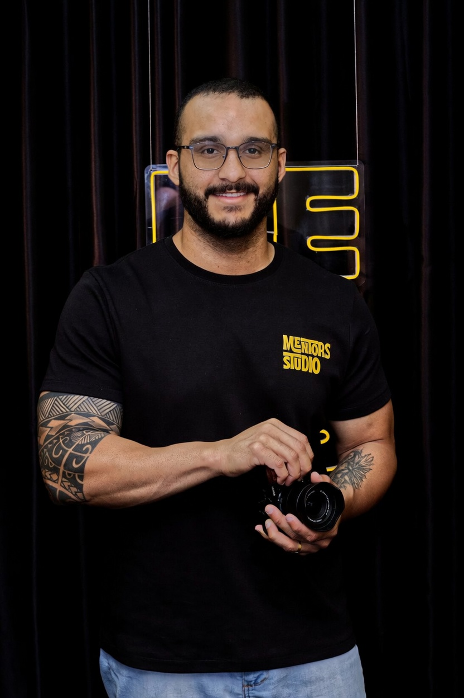

# PRISMA

### Biblioteca inteligente de mídia, feita por um editor de vídeo — para editores de vídeo.
### Smart media library, built by a video editor — for video editors.

**Gratuito · Funciona offline · Nunca toca nos seus arquivos originais.**
**Free · Works offline · Never touches your original files.**

Windows · Tauri 2 (Rust) + React/TypeScript + SQLite + ffmpeg

[**⬇ Baixar / Download**](https://github.com/Paulothedeveloper/prisma/releases/latest) · [Releases](https://github.com/Paulothedeveloper/prisma/releases) · [Issues](https://github.com/Paulothedeveloper/prisma/issues)

**🇧🇷 [Português](#-português) · 🇺🇸 [English](#-english)**

---

## 🇧🇷 Português

### O que é o PRISMA

O PRISMA é um **gerenciador de acervo de mídia (DAM)** pensado do zero para o fluxo de quem **edita e finaliza vídeo**. Ele indexa as suas pastas **no lugar onde elas já estão** — não move, não copia, não renomeia e **não altera** nenhum arquivo original — e te dá uma central rápida para encontrar, pré-visualizar, etiquetar e **preparar** seus assets.

Além de catalogar, o PRISMA entende a parte **técnica** do vídeo: lê os metadados de cor de cada clipe e recomenda **a configuração de CST (espaço de cor) para o DaVinci Resolve**, gera **proxies** automaticamente para tocar codecs profissionais, **diagnostica problemas** (VFR, banding, codec pesado) e **conserta** com um clique — sempre em arquivo novo.

### Para quem é

- **Editores e finalizadores** com milhares de arquivos espalhados em HDs.
- **Coloristas** que querem a recomendação de CST certa por clipe (709, S-Log3, HLG, Apple Log…).
- **Criadores de conteúdo** (Reels, YouTube) que trabalham com material de câmera e celular.
- Quem quer uma biblioteca de mídia **local, privada e sem mensalidade**.

### Principais recursos

- 🗂️ **Catálogo de qualquer mídia** (vídeo, áudio, imagem, GIF) — miniaturas, forma de onda, cor, tags, estrelas.
- ⚡ **Pré-visualização fluida** + **proxies automáticos** para tocar ProRes/DNxHR/.mov.
- 🎨 **Leitor CST de 2 nós** (entrada + saída) com destino de entrega configurável.
- 🩺 **Saúde da biblioteca**: selos de diagnóstico e **auto-conserto** (VFR→CFR, anti-banding, proxy).
- 🤖 **Assistente de pós com IA** (opcional): lê o seu vault e monta um plano de color citando a fonte.
- 🛠️ **Oficina** de codificação + **MotionSilk** (estabilização).
- 📁 **Pastas inteligentes**, **busca por imagem**, **duplicados** e **Lixeira** reversível.
- 🔗 **Ecossistema integrado**: conversa com o **Quartzo** (nosso PKM — ligar assets às suas notas) e com o **VELVET** (cor no DaVinci Resolve — escolhe a LUT do seu catálogo por humor). Ver [Ecossistema](#-ecossistema--ecosystem).
- 🧠 **Busca semântica local (CLIP)**: ache imagens por **ideia**, não só por nome — "pôr do sol na praia" — 100% offline, sem mandar nada pra nuvem.
- 🧰 **Recursos do Eagle, nativos**: baixador de vídeo/áudio (yt-dlp), player com letra sincronizada, RAW/HEIC/JXL com miniatura, Live Photo, "Perguntar à IA", **ampliar imagem 4x com IA** (Real-ESRGAN) e **remover fundo com IA** (u2netp, ONNX em Rust) — tudo embutido, sem plugins.

### Privacidade e segurança — pode usar sem medo

- 🔒 **Roda 100% no seu computador.** Sem servidor, sem login, sem nuvem.
- 🛡️ **Nunca toca nos originais.** Toda operação gera arquivos novos em subpastas.
- 👀 **Código aberto.** Este repositório é público — dá pra inspecionar tudo.
- 🤖 **A IA é opcional e usa a SUA chave** da API da Anthropic. A chave fica **só neste PC**, **nunca é enviada para nós**; só a miniatura (512px) é analisada, e **apenas quando você clica**. Sem IA, todo o resto funciona offline.

### Como instalar

1. Vá em **[Releases](https://github.com/Paulothedeveloper/prisma/releases/latest)**.
2. Baixe **`PRISMA_x.y.z_x64-setup.exe`** (instalador em português).
3. Rode, abra o PRISMA e adicione uma pasta. O instalador é autocontido (ffmpeg embutido).

---

## 🇺🇸 English

### What PRISMA is

PRISMA is a **Digital Asset Manager (DAM)** built from scratch for people who **edit and finish video**. It indexes your folders **in place** — it never moves, copies, renames or **alters** your original files — and gives you a fast hub to find, preview, tag and **prepare** your assets.

Beyond cataloging, PRISMA understands the **technical** side of video: it reads each clip's color metadata and recommends the **Color Space Transform (CST) setup for DaVinci Resolve**, auto-generates **proxies** to play pro codecs, **diagnoses problems** (VFR, banding, heavy codecs) and **fixes them** in one click — always to a new file.

### Who it's for

- **Editors & finishers** with thousands of files scattered across drives.
- **Colorists** who want the right per-clip CST (709, S-Log3, HLG, Apple Log…).
- **Content creators** (Reels, YouTube) working with camera and phone footage.
- Anyone who wants a **local, private, subscription-free** media library.

### Key features

- 🗂️ **Catalog any media** (video, audio, image, GIF) — thumbnails, waveform, color, tags, ratings.
- ⚡ **Fluid preview** + **automatic proxies** to play ProRes/DNxHR/.mov.
- 🎨 **2-node CST reader** (input + output) with a configurable delivery target.
- 🩺 **Library health**: diagnosis badges and **auto-fix** (VFR→CFR, anti-banding, proxy).
- 🤖 **AI post-assistant** (optional): reads your notes vault and builds a color plan, citing the source.
- 🛠️ **Encoder workshop** + **MotionSilk** (stabilization).
- 📁 **Smart folders**, **image search**, **duplicates** and a reversible **Trash**.
- 🔗 **Integrated ecosystem**: talks to **Quartzo** (our PKM — link assets to your notes) and to **VELVET** (color in DaVinci Resolve — picks the LUT from your catalog by mood). See [Ecosystem](#-ecossistema--ecosystem).
- 🧠 **Local semantic search (CLIP)**: find images by **idea**, not just name — "sunset on the beach" — 100% offline, nothing leaves your machine.
- 🧰 **Eagle features, native**: video/audio downloader (yt-dlp), synced-lyrics player, RAW/HEIC/JXL thumbnails, Live Photo, "Ask AI", **AI 4x image upscaling** (Real-ESRGAN) and **AI background removal** (u2netp, ONNX in Rust) — all built in, no plugins.

### Privacy & security — use it with confidence

- 🔒 **Runs 100% on your computer.** No server, no login, no cloud.
- 🛡️ **Never touches originals.** Every operation writes new files in subfolders.
- 👀 **Open source.** This repo is public — inspect everything.
- 🤖 **AI is optional and uses YOUR own Anthropic API key.** The key stays **only on your PC**, is **never sent to us**; only the 512px thumbnail is analyzed, and **only when you click**. Without AI, everything else works offline.

### Install

1. Go to **[Releases](https://github.com/Paulothedeveloper/prisma/releases/latest)**.
2. Download **`PRISMA_x.y.z_x64-setup.exe`**.
3. Run it, open PRISMA and add a folder. The installer is self-contained (ffmpeg bundled).

---

## 🔗 Ecossistema · Ecosystem

O PRISMA não vive sozinho — ele é o **almoxarifado de assets** de um ecossistema de softwares
próprios. *PRISMA doesn't live alone — it's the **asset warehouse** of a suite of in-house tools.*

- **🎨 VELVET** (cor no DaVinci Resolve · color in DaVinci Resolve) — o PRISMA exporta o
  **catálogo de LUTs com o humor de cada uma** (quente/frio, claro/escuro, vívido) e o VELVET
  escolhe a LUT certa dentro do Resolve. *PRISMA exports the **LUT catalog tagged by mood** and
  VELVET picks the right one inside Resolve.* → Configurações › Ecossistema.
- **📝 QUARTZO** (PKM/notas · notes) — em vez de depender do Obsidian, o PRISMA liga os assets
  às suas notas no **Quartzo**, que é **software nosso**: anexe um asset a uma nota e veja quais
  notas o citam. *Instead of relying on Obsidian, PRISMA links assets to your notes in **Quartzo**,
  our own software.* → painel Detalhes › Quartzo.

Contrato técnico da integração: **[docs/INTEGRATION.md](docs/INTEGRATION.md)**.

> Papéis · Roles: **QUARTZO ensina COMO · PRISMA diz COM O QUÊ · a IA decide · VELVET aplica.**

---

## Stack

- **Desktop:** [Tauri 2](https://tauri.app) (Rust) · **UI:** React 19 + TypeScript (Vite) · **DB:** SQLite
- **Media:** ffmpeg / ffprobe · **AI (optional):** Anthropic API (Claude) — user's own key

## 🆕 Histórico de versões · Changelog

**0.9.24** — Badges de condição + inspetor com toggle + auditoria
- 🔴 **Badges de condição** no canto do card (sem áudio, VFR, mono, 8-bit…), cada um com cor + tooltip. **Saúde calculada no import** → mídia dentro de pastas também vem marcada.
- 🪟 **Inspetor com toggle:** clicar um card só seleciona (dá pra arrastar sem o painel pular). Detalhes abre pelo botão da barra ou menu de contexto.
- 🟦 **Cards de pasta:** bordas não se sobrepõem mais ao mudar o tamanho dos ícones.
- 🔍 **Auditoria:** compila limpo, contrato front↔back 100%, i18n 681 chaves completas (PT/EN/ES).

**0.9.23** — Estabilizar (sem giroscópio)
- 🎥 Nova **estabilização óptica** na Oficina de qualquer vídeo (ffmpeg `vidstab`, 2 passadas) — funciona sem giroscópio, em qualquer material. Saída em `ESTABILIZADO/`, original intacto. O MotionSilk (Gyroflow) segue para clipes com gyro.

**0.9.22** — Correção dos acentos na interface
- 🔤 Acentos quebrados (Resolução, Duração, Aleatório…) **corrigidos** — era um erro de codificação UTF-8 no arquivo de textos (PT/EN/ES).

**0.9.21** — Visualizador responsivo + seleção + Quartzo opcional
- 🪟 Visualizador (preview) **se adapta ao tamanho da janela** (o vídeo encolhe junto).
- 🔲 Contorno de seleção **não corta** mais na fileira de cima dos cards.
- 📝 **Integração Quartzo (notas) opcional** — liga/desliga em Configurações › Aparência (desligada por padrão).

**0.9.20** — Vídeo toca dentro do app (player externo opcional)
- ▶️ **ProRes/.mov tocam inline** pelo proxy H.264 (o WebView não decodifica codec pro). Se o vídeo ainda não tem proxy, o botão **"Tocar aqui"** gera na hora e toca. O "Abrir no player externo" virou opcional.

**0.9.19** — Deep-link `prisma://` (fecha o ida-e-volta com Quartzo/VELVET)
- 🔗 **Clicar um `prisma://asset/<id>`** numa nota (Obsidian/Quartzo) **foca o PRISMA e abre o asset**. O app já escrevia esses links ao anexar; agora eles funcionam de volta. Single-instance (não abre 2ª janela) + esquema registrado no Windows.

**0.9.18** — CLIP++ (buscar parecidas por IA)
- 🧠 **Busca por exemplo:** clique direito numa imagem/GIF/vídeo → **"Parecidas por IA (CLIP)"** acha os assets visualmente parecidos por **significado** (não por pixel). Requer a busca semântica indexada.

**0.9.17** — Volume no player + cards de pasta sem esticar
- 🔊 **Controle de volume (com mudo)** no player de rodapé.
- 📁 **Cards de pasta não esticam mais** ao mudar o zoom dos ícones (o grid não estica mais as linhas — cada card tem a altura do conteúdo).
- 🛡️ **Caixa de download** não fecha no meio de um download (botão/X/Esc protegidos).

**0.9.16** — Player playlist, preview na lista, auditoria funcional (25+ correções)
- 🎵 **Player de rodapé estilo playlist:** clique num áudio e ouça um atrás do outro — anterior / play-pause / próxima / detalhes, com auto-avanço. Ideal para bibliotecas grandes de música/SFX.
- 🖱️ **Preview no hover também na visão de LISTA** (antes só na grade) + **transição suave** ao trocar o modo de visualização.
- 📁 **Cards de pasta** repaginados (aba + capa em moldura + tom azul) e **scroll da grade de pastas corrigido** (havia conteúdo escondido).
- 🔍 **Auditoria funcional profunda (6 agentes):** Live Photos não esconde vídeos independentes; vídeo só-áudio não é apagado como corrompido; busca via **índice FTS5**; importação não congela o app (varredura sem segurar o banco); **path traversal** bloqueado; **restore** valida e faz backup antes de trocar; sem panic quando o banco está ocupado; pastas inteligentes escondem frames de sequência; chave da API protegida; cancelar importação interrompe o proxy no meio; modais mais robustos.

**0.9.15** — Cancelar importação + barra estável + cards de pasta
- 🛑 **Botão Cancelar** na barra de importação (e no carregamento): para o processamento na hora; o que já foi catalogado fica.
- 📊 **Barra de progresso monotônica:** acabou o "sobe e desce" da porcentagem quando há operações em paralelo.
- ✨ **Fim do flicker:** a grade de pastas não pisca mais alternando com a tela de carregamento.
- 📁 **Cards de pasta repaginados:** aba + capa embutida em moldura + tom azulado — leem como pasta, não como mídia.
- 🔳 **Tela cheia:** duplo-clique em qualquer mídia abre o visualizador; vídeo tem botão de tela cheia real do sistema.

**0.9.14** — Importação leve, só mídia, auditoria funcional
- ⚡ **A importação não trava mais o PC.** As threads de trabalho (importar, proxies, IA, saúde) agora rodam em **modo background do Windows** — prioridade baixa de **CPU e de disco** — então o PRISMA cede a vez pro primeiro plano (a UI, o DaVinci). Concorrência de import reduzida para mais suavidade.
- 🎯 **Só mídia entra:** importa apenas **vídeo, áudio, imagem e GIF**. Documentos, LUTs, fontes e extensões desconhecidas são recusados, com **aviso** de quantos foram ignorados.
- ⏸️ **Caixas de diálogo pausam o trabalho pesado** (ex.: modal de duplicados) — aparecem instantâneas, sem engasgo.
- 🛑 Acima de **1000 arquivos** numa importação, o app confirma antes.
- 🔍 **Auditoria funcional completa:** contrato frontend↔backend 100% íntegro (108 comandos, 107 chamadas, 21 eventos — zero quebrado).

**0.9.13** — Remoção definitiva + desempenho
- 🩹 **Remover pasta agora é permanente.** Antes, uma pasta removida podia "voltar" ao renomear/mexer numa pasta vizinha (o monitor re-catalogava os arquivos que continuavam no disco). Agora a pasta removida vai para uma **lista de exclusão** persistente — o monitor e qualquer re-escaneamento a ignoram, e os índices/proxies dela são apagados de verdade. Re-adicionar a pasta cancela a exclusão.
- ⚡ **Desempenho em bibliotecas grandes (27 mil+):** busca por imagem/CLIP em uma só consulta (era N+1), índice para ordenar por tamanho, contadores da barra lateral em uma varredura só, *throttle* nos eventos de proxy, e sidebar/inspetor memoizados.
- ✨ Indicador de carregamento premium ao remover uma pasta (com ✓ ao concluir).

## Licença · License

Distribuído **gratuitamente** · Distributed **free of charge**.

---

### 👤 Sobre o criador · About the creator

**Paulo Adriel** — produtor & editor de vídeo (Mentors Studio) e desenvolvedor indie · Porto Velho/RO, Brasil 🇧🇷

Construo as ferramentas que eu mesmo uso, sempre partindo de um problema real de edição e finalização. O PRISMA é **open-source** e melhora todo dia.

*Video producer & editor and indie developer. I build the tools I use myself — PRISMA is open-source and improves every day.*

Feito com cuidado, por quem edita — para quem edita. · Made with care, by an editor — for editors.

