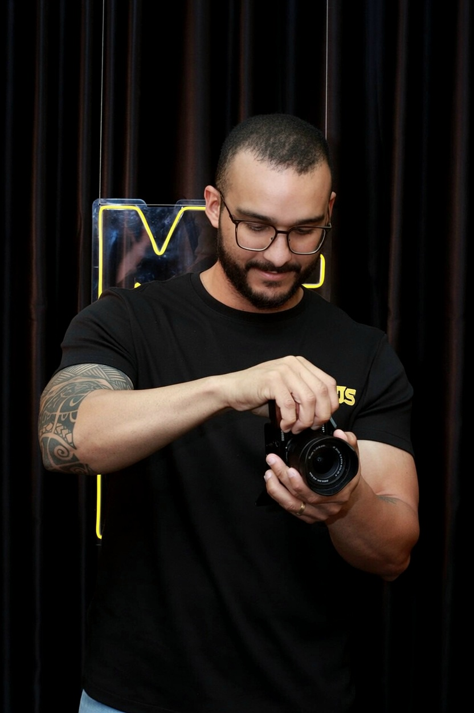

# PRISMA

### Biblioteca inteligente de mídia, feita por um editor de vídeo — para editores de vídeo.
### Smart media library, built by a video editor — for video editors.

**Gratuito · Funciona offline · Nunca toca nos seus arquivos originais.**
**Free · Works offline · Never touches your original files.**

Windows · Tauri 2 (Rust) + React/TypeScript + SQLite + ffmpeg

[**⬇ Baixar / Download**](https://github.com/Paulothedeveloper/prisma/releases/latest) · [Releases](https://github.com/Paulothedeveloper/prisma/releases) · [Issues](https://github.com/Paulothedeveloper/prisma/issues)

**🇧🇷 [Português](#-português) · 🇺🇸 [English](#-english)**

---

## 🇧🇷 Português

### O que é o PRISMA

O PRISMA é um **gerenciador de acervo de mídia (DAM)** pensado do zero para o fluxo de quem **edita e finaliza vídeo**. Ele indexa as suas pastas **no lugar onde elas já estão** — não move, não copia, não renomeia e **não altera** nenhum arquivo original — e te dá uma central rápida para encontrar, pré-visualizar, etiquetar e **preparar** seus assets.

Além de catalogar, o PRISMA entende a parte **técnica** do vídeo: lê os metadados de cor de cada clipe e recomenda **a configuração de CST (espaço de cor) para o DaVinci Resolve**, gera **proxies** automaticamente para tocar codecs profissionais, **diagnostica problemas** (VFR, banding, codec pesado) e **conserta** com um clique — sempre em arquivo novo.

### Para quem é

- **Editores e finalizadores** com milhares de arquivos espalhados em HDs.
- **Coloristas** que querem a recomendação de CST certa por clipe (709, S-Log3, HLG, Apple Log…).
- **Criadores de conteúdo** (Reels, YouTube) que trabalham com material de câmera e celular.
- Quem quer uma biblioteca de mídia **local, privada e sem mensalidade**.

### Principais recursos

- 🗂️ **Catálogo de qualquer mídia** (vídeo, áudio, imagem, GIF) — miniaturas, forma de onda, cor, tags, estrelas.
- ⚡ **Pré-visualização fluida** + **proxies automáticos** para tocar ProRes/DNxHR/.mov.
- 🎨 **Leitor CST de 2 nós** (entrada + saída) com destino de entrega configurável.
- 🩺 **Saúde da biblioteca**: selos de diagnóstico e **auto-conserto** (VFR→CFR, anti-banding, proxy).
- 🤖 **Assistente de pós com IA** (opcional): lê o seu vault e monta um plano de color citando a fonte.
- 🛠️ **Oficina** de codificação + **MotionSilk** (estabilização).
- 📁 **Pastas inteligentes**, **busca por imagem**, **duplicados** e **Lixeira** reversível.

### Privacidade e segurança — pode usar sem medo

- 🔒 **Roda 100% no seu computador.** Sem servidor, sem login, sem nuvem.
- 🛡️ **Nunca toca nos originais.** Toda operação gera arquivos novos em subpastas.
- 👀 **Código aberto.** Este repositório é público — dá pra inspecionar tudo.
- 🤖 **A IA é opcional e usa a SUA chave** da API da Anthropic. A chave fica **só neste PC**, **nunca é enviada para nós**; só a miniatura (512px) é analisada, e **apenas quando você clica**. Sem IA, todo o resto funciona offline.

### Como instalar

1. Vá em **[Releases](https://github.com/Paulothedeveloper/prisma/releases/latest)**.
2. Baixe **`PRISMA_x.y.z_x64-setup.exe`** (instalador em português).
3. Rode, abra o PRISMA e adicione uma pasta. O instalador é autocontido (ffmpeg embutido).

---

## 🇺🇸 English

### What PRISMA is

PRISMA is a **Digital Asset Manager (DAM)** built from scratch for people who **edit and finish video**. It indexes your folders **in place** — it never moves, copies, renames or **alters** your original files — and gives you a fast hub to find, preview, tag and **prepare** your assets.

Beyond cataloging, PRISMA understands the **technical** side of video: it reads each clip's color metadata and recommends the **Color Space Transform (CST) setup for DaVinci Resolve**, auto-generates **proxies** to play pro codecs, **diagnoses problems** (VFR, banding, heavy codecs) and **fixes them** in one click — always to a new file.

### Who it's for

- **Editors & finishers** with thousands of files scattered across drives.
- **Colorists** who want the right per-clip CST (709, S-Log3, HLG, Apple Log…).
- **Content creators** (Reels, YouTube) working with camera and phone footage.
- Anyone who wants a **local, private, subscription-free** media library.

### Key features

- 🗂️ **Catalog any media** (video, audio, image, GIF) — thumbnails, waveform, color, tags, ratings.
- ⚡ **Fluid preview** + **automatic proxies** to play ProRes/DNxHR/.mov.
- 🎨 **2-node CST reader** (input + output) with a configurable delivery target.
- 🩺 **Library health**: diagnosis badges and **auto-fix** (VFR→CFR, anti-banding, proxy).
- 🤖 **AI post-assistant** (optional): reads your notes vault and builds a color plan, citing the source.
- 🛠️ **Encoder workshop** + **MotionSilk** (stabilization).
- 📁 **Smart folders**, **image search**, **duplicates** and a reversible **Trash**.

### Privacy & security — use it with confidence

- 🔒 **Runs 100% on your computer.** No server, no login, no cloud.
- 🛡️ **Never touches originals.** Every operation writes new files in subfolders.
- 👀 **Open source.** This repo is public — inspect everything.
- 🤖 **AI is optional and uses YOUR own Anthropic API key.** The key stays **only on your PC**, is **never sent to us**; only the 512px thumbnail is analyzed, and **only when you click**. Without AI, everything else works offline.

### Install

1. Go to **[Releases](https://github.com/Paulothedeveloper/prisma/releases/latest)**.
2. Download **`PRISMA_x.y.z_x64-setup.exe`**.
3. Run it, open PRISMA and add a folder. The installer is self-contained (ffmpeg bundled).

---

## Quem fez · About the creator

**Paulo Adriel** — produtor e editor de vídeo (Mentors Studio). O PRISMA nasceu de problemas reais do dia a dia de edição e finalização: uma biblioteca que entendesse de **vídeo de verdade** (cor, codec, proxy), não só de miniaturas. O desenvolvimento é **aberto e contínuo** — todo dia a gente tenta melhorar.

**Paulo Adriel** — video producer & editor. PRISMA was born from real day-to-day editing and finishing problems: a library that actually understands **video** (color, codec, proxy), not just thumbnails. Development is **open and ongoing** — we try to improve it every day.

📷 Instagram: [@paulomentors](https://instagram.com/paulomentors) · ✉️ paulobatista19988@proton.me

 

## Stack

- **Desktop:** [Tauri 2](https://tauri.app) (Rust) · **UI:** React 19 + TypeScript (Vite) · **DB:** SQLite
- **Media:** ffmpeg / ffprobe · **AI (optional):** Anthropic API (Claude) — user's own key

## Licença · License

Distribuído **gratuitamente** · Distributed **free of charge**.

---

Feito com cuidado, por quem edita — para quem edita. · Made with care, by an editor — for editors.

